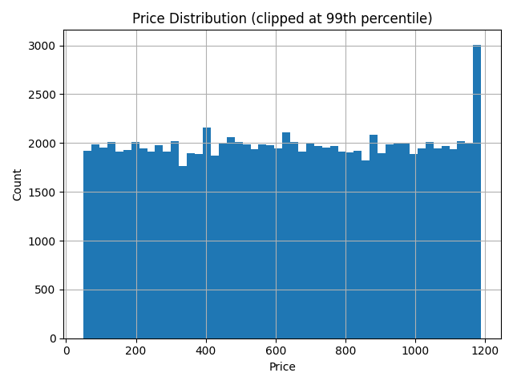
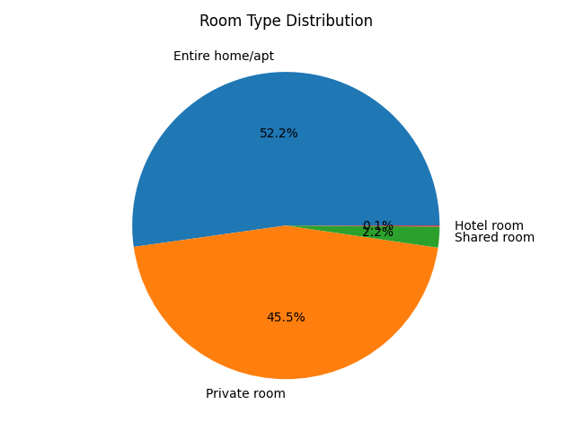
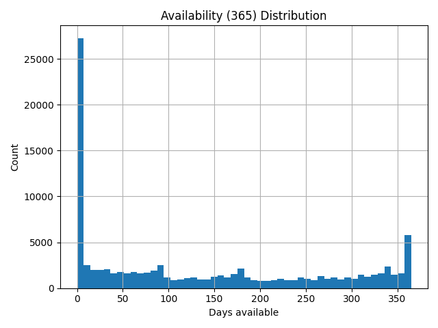

# Airbnb Market Analysis

This end-to-end project analyzes Airbnb listings to uncover **pricing patterns, supply trends, and host dynamics**. It demonstrates skills in **data engineering, analytics, visualization, and dashboarding**, turning raw CSV data into insights and a fully interactive Streamlit app.  

Author: **Manoj Pemmasani**  
🔗 [LinkedIn](https://www.linkedin.com/in/manojpemmasani)  

---

## Highlights
- **Business Value**: Answers questions like  
  - Which neighborhoods are most expensive?  
  - What’s the mix of room types?  
  - Who are the top hosts in the market?  
- **End-to-End Pipeline**: Raw CSV → Clean Parquet → EDA outputs → SQL schema → Interactive dashboard.  
- **Technical Breadth**: Python (Pandas, Plotly), Streamlit, Parquet optimization, SQL schema design.  

---

## Insights (Sample Results)
- **Most expensive neighborhood group**: Manhattan (~$230 avg. price).  
- **Least expensive**: Bronx (~$70 avg. price).  
- **Room type mix**: Entire home (52%), Private room (44%), Shared/Other (4%).  
- **Top host**: 327 listings in dataset.  
- **Correlation signals**: Weak link between price & reviews; availability more impactful.  

---

## Visuals
Some outputs from `/notebooks/figures/`:  

-   
-   
-   

---

## Skills Demonstrated
- **Data Cleaning**: Outlier handling, currency parsing, date formatting, null audits.  
- **Analytics**: KPIs, correlations, group-bys, ranking (top hosts).  
- **Visualization**: Histograms, pie charts, maps, correlation matrices.  
- **Engineering**: Parquet optimization, environment management with `.env`.  
- **SQL Design**: Schema + queries mirroring Pandas analysis.  
- **Dashboarding**: Streamlit app with filters, KPIs, plots, and map.  

---

## How to Run
1. Setup environment:  
   ```bash
   python -m venv .venv
   source .venv/bin/activate    # (Linux/Mac)
   .venv\Scripts\activate       # (Windows)
   pip install -r requirements.txt
   ```  
2. Copy `.env.example` → `.env` and set paths.  
3. Run pipeline + EDA:  
   ```bash
   python src/clean_airbnb.py
   python src/eda_airbnb.py
   ```  
4. Launch dashboard:  
   ```bash
   streamlit run src/app.py
   ```  

---

## Future Improvements
- Automate pipeline with **Airflow**.  
- Deploy dashboard via **Streamlit Cloud / Docker**.  
- Extend schema for **multi-city comparison**.  

---

## License
MIT License.  
